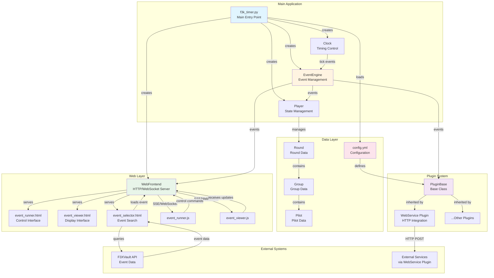

# F3K Timer Architecture

## Overview

F3K Timer is an event-driven, plugin-based timing system for F3K model aircraft competitions. It uses asynchronous Python with a web-based interface for control and display.

## Architecture Diagram



## Core Components

### Main Application Layer

#### f3k_timer.py (Main Entry Point)

- Loads configuration from `config.yml`
- Initializes all major components
- Sets up event loop and starts web server
- Manages plugin lifecycle

#### EventEngine

- Async event bus for component communication
- Provides pub/sub mechanism for events
- Events include: `onSecond`, `onNewRound`, `onDefPilot`, etc.
- Supports both sync and async event handlers

#### Clock

- Provides timing control with FPS limiting
- Uses `tick()` method for consistent frame timing
- Calculates actual FPS for monitoring
- Based on `pygame.time.get_ticks()` for millisecond precision

#### Player

- Manages competition state and progression
- Controls rounds, groups, and timing sections
- Generates state updates for display
- Handles control commands (start, pause, skip, etc.)

### Web Layer

#### WebFrontend (aiohttp server)

- HTTP server on configurable port (default 80)
- WebSocket endpoint (`/ws/`) for bidirectional communication
- Server-Sent Events (`/state-stream`) for state updates
- REST endpoints for control (`/control/<action>`, `/goto/<round>/<group>`)
- Serves static HTML/JS assets

#### Web Interfaces

**event_runner.html**

- Control interface for competition operators
- Large time display
- Control buttons (start, pause, skip, etc.)
- Round/group selection
- Uses EventSource for real-time updates

**event_viewer.html**

- Public display interface
- Shows current time, round, group, section
- Displays pilot list for current group
- Auto-reconnecting WebSocket for resilience

**event_selector.html**

- Event search and loading interface
- Integrates with F3XVault API
- Filters by country, date range, event type
- Saves search preferences in cookies
- Loads selected event configuration

### Data Layer

#### Configuration (config.yml)

YAML-based configuration with multiple sections:

- `main`: Core timing parameters (prep_time, group_separation_time, voice)
- `web`: Web server settings (port)
- Plugin configurations with `module` and `object_name` for dynamic loading

#### Domain Model

**Round**

- Represents a competition round
- Contains list of Groups
- Stores task-specific configuration (window time, number of flights, etc.)

**Group**

- Represents a group of pilots flying together
- Generates timing sections via iterator (prep, no-fly, work, land, gap)
- Section durations calculated from event config and round parameters

**Pilot**

- Pilot information and state
- Associated with groups

### Plugin System

#### PluginBase

- Abstract base class for all plugins
- Receives EventEngine instance in constructor
- Can subscribe to any event type
- Configured via `config.yml`

#### Plugin Loading

Dynamic plugin instantiation from config:

```yaml
name: PluginName
module: plugin_module_name
object_name: ClassName
# ...additional plugin-specific config...
```

#### WebService Plugin

- Forwards state updates to external HTTP endpoint
- Configurable URL and HTTP method (POST/GET)
- Handles connection failures gracefully
- Implements retry logic with failure threshold

### External Systems

#### F3XVault API Integration

- RESTful API for event data
- Authentication via login credentials
- Event search with filters
- Event detail retrieval
- JSON format for event configuration

#### External Service Integration

- Via WebService plugin
- Real-time state forwarding
- JSON payload with competition state
- Configurable endpoints per deployment

## Key Design Patterns

### Event-Driven Architecture

- Components communicate via EventEngine
- Loose coupling between subsystems
- Easy to add new event types and handlers
- Supports async event propagation

### Plugin Architecture

- Core functionality extended via plugins
- Runtime plugin loading from configuration
- Plugin isolation with error handling
- No core code changes needed for extensions

### Async/Await Throughout

- Non-blocking I/O operations
- Concurrent handling of web requests and timing
- asyncio event loop manages all async tasks
- Efficient resource usage

### Client-Server with Real-Time Updates

- WebSocket for bidirectional control
- Server-Sent Events for unidirectional state streaming
- Automatic reconnection on connection loss
- Multiple simultaneous clients supported

## Event Flow

1. **Startup**
   - Load config.yml
   - Create EventEngine, Clock, Player
   - Initialize plugins from config
   - Start WebFrontend server

2. **Timing Loop**
   - Clock generates tick events at configured FPS
   - Player updates state on each tick
   - EventEngine broadcasts state changes
   - Plugins receive and process events

3. **State Updates**
   - Player emits state every second
   - WebFrontend receives state via EventEngine
   - State broadcast to all connected clients via SSE
   - Clients update UI in real-time

4. **Control Flow**
   - User clicks button in event_runner.html
   - JavaScript sends POST to `/control/<action>`
   - WebFrontend routes to Player control method
   - Player updates state, triggers events
   - New state flows back to clients

## Configuration

Example `config.yml` structure:

```yaml
---
name: main
prep_time: 120
use_strict_test_time: False
group_separation_time: 5
voice: en_US-lessac-medium

---
name: web
port: 80

---
name: Web
module: plugin_web_service
object_name: WebService
url: https://fxtiming.ddns.net/api/event/
```

## Dependencies

- **aiohttp**: Async HTTP server and client
- **pygame**: Timing and audio playback
- **PyYAML**: Configuration parsing
- **requests**: HTTP client for plugins
- **Bootstrap**: UI framework for web interfaces
- **scipy/numpy**: Audio generation for tones

## Deployment Considerations

- Designed for Raspberry Pi deployment
- Network detection script for WiFi interface configuration
- Service management via systemd
- Log rotation for production use
- Cookie-based state persistence for user preferences
